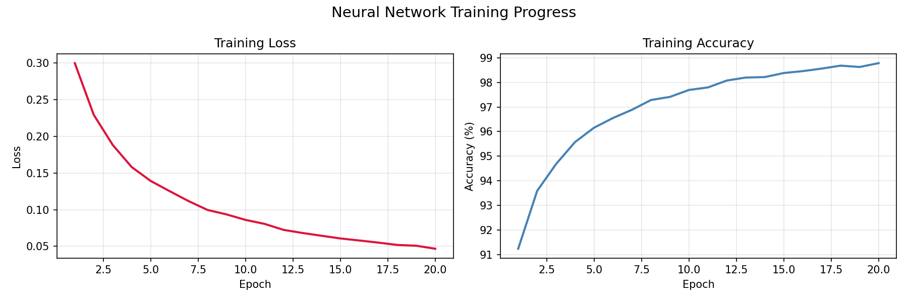
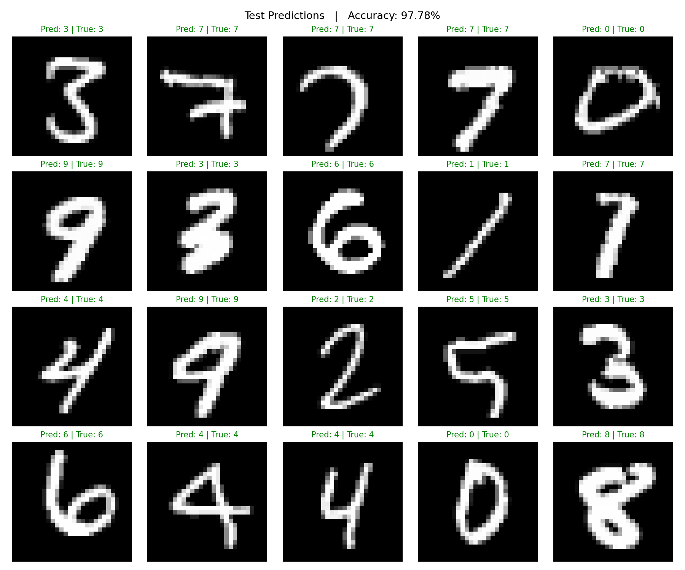

# Neural Network from Scratch — MNIST Digit Recognition

A fully functional neural network built using only Python and NumPy — no TensorFlow, 
no PyTorch, no ML frameworks of any kind. Every operation, from the forward pass to 
backpropagation, is implemented from first principles. Trained on the MNIST dataset 
and achieves 97.78% accuracy on handwritten digit recognition.

---

## Demo

---

## What is this project?

Most people who use AI tools today have no idea what's happening underneath. This 
project is an attempt to understand that — by building the whole thing from scratch.

A neural network is, at its core, just a lot of numbers (called weights) arranged in 
layers. When you train it, you're teaching it to adjust those numbers until it gets 
good at a task. In this case, the task is looking at a 28x28 image of a handwritten 
digit and correctly identifying which number it is.

There's no magic here — just matrix multiplication, a few mathematical functions, and 
a loop that runs 20 times. By the end of that loop, the network has seen 60,000 
handwritten digits and learned to recognise them with 97.78% accuracy.

---

## How it works — step by step

### 1. The data
The network is trained on MNIST — a dataset of 70,000 handwritten digit images 
collected from real people. Each image is 28x28 pixels, which we flatten into a list 
of 784 numbers. Each number is a pixel brightness between 0.0 (black) and 1.0 (white).

### 2. The architecture
The network has three layers:
